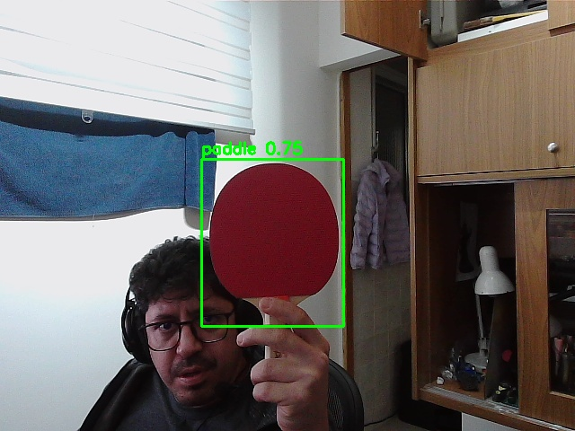

# pingpong-qualcomm

Teaching a computer to recognize a **ping-pong paddle** — from an empty folder to a
live camera feed running on a **Qualcomm NPU** (the AI chip on a Qualcomm IQ-8275 EVK
edge board).

This repo is the complete, honest record of that journey: every model, every script,
every dead end, and the two counterintuitive lessons that make it worth reading.

<p align="center">
  
  <br><em>The goal: a green box that follows the paddle, drawn in real time by the NPU.</em>
</p>

## Two ways to read this

| If you want to… | Read this |
|---|---|
| **Understand what we did and why** — in plain language, no AI background needed (written so my grandfather could follow it) | **[docs/STORY.md](docs/STORY.md)** |
| **Reproduce it yourself** — the full step-by-step guide with every command and file, so someone who has never trained an AI model can do exactly what we did | **[docs/REPRODUCE.md](docs/REPRODUCE.md)** |

## The 60-second version

We taught a computer to spot a ping-pong paddle in a camera image. We did it **twice**:

1. **A small neural network built from scratch.** It learned — but only recognized the
   paddle in situations that looked like its training photos. Put a big face close to the
   camera in a dim room and it went blind. **Lesson: a small model trained on a few hundred
   photos memorizes its world; it doesn't understand paddles.**

2. **YOLOv8 — a model pre-trained on millions of images — fine-tuned on our paddle photos.**
   It just worked, everywhere, including the exact scene that broke model #1.
   **Lesson: standing on the shoulders of a big pre-trained model beats building small from zero.**

Then we made it run on the board's dedicated **AI chip (NPU)** instead of its regular
processor (CPU). The NPU does the raw math **~84× faster** (1.7 ms vs 145 ms). Getting that
speedup end-to-end took one more insight: the model runs on 16-bit integers, so a naive setup
lets the SDK convert every camera frame float→int (and back) one number at a time on the CPU —
which costs more than the math the NPU saves. Once we move that conversion to vectorized numpy
and hand the chip the bytes it wants directly, the **NPU wins the whole pipeline: 1.7× faster**
than the CPU (25 ms vs 42 ms per frame). **Lesson: a faster engine only helps if the road to it
isn't the bottleneck — feed the accelerator in its native format.**

## What's inside

```
training/   Phase A — a CNN built from scratch (PyTorch), the baseline that taught us why we needed YOLO
yolo/       Phase B — YOLOv8 fine-tuning + the tools to convert & benchmark it
web/        The live webcam demo (a tiny web server that streams detections to a browser)
npu/        Phase C & D — converting the model for the Qualcomm NPU and the C++ daemon that runs it live
docs/       The two write-ups (STORY.md and REPRODUCE.md)
```

## The hardware

- **Training:** a Mac (Apple Silicon, PyTorch + MPS/Metal). Models are always *trained* here.
- **Inference:** a **Qualcomm IQ-8275 EVK** edge board (QCS8300, Hexagon V75 NPU, aarch64,
  Python 3.14). Models are *run* here — first on its CPU, then on its NPU.

## Results at a glance

| | Phase A: CNN from scratch | Phase B: YOLOv8n fine-tuned |
|---|---|---|
| Accuracy | val IoU **0.56** | mAP@0.5 **0.98** |
| Real-world close-up (big face, dim room) | ❌ misses the paddle | ✅ finds it (p≈0.75) |

| Running YOLOv8n on the board | Latency | Throughput |
|---|---|---|
| CPU (onnxruntime), full pipeline | 42.0 ms | 23.8 FPS |
| NPU (Hexagon V75), **raw math only** | **1.7 ms** | ~576 FPS |
| NPU (Hexagon V75), **full pipeline** | **25.3 ms** | **39.5 FPS** |

The NPU is **1.7× faster end-to-end** than the CPU — same detection, same box
(CPU p=0.742, NPU p=0.746). The trick that got it there — feeding the chip its native
16-bit format instead of letting the SDK convert frames one number at a time — is the
whole story of Phase C/D — see [docs/STORY.md](docs/STORY.md#part-6).

## License

MIT — see [LICENSE](LICENSE). The dataset photos are not included (they were captured
privately); [docs/REPRODUCE.md](docs/REPRODUCE.md#step-1) shows how to make your own.
