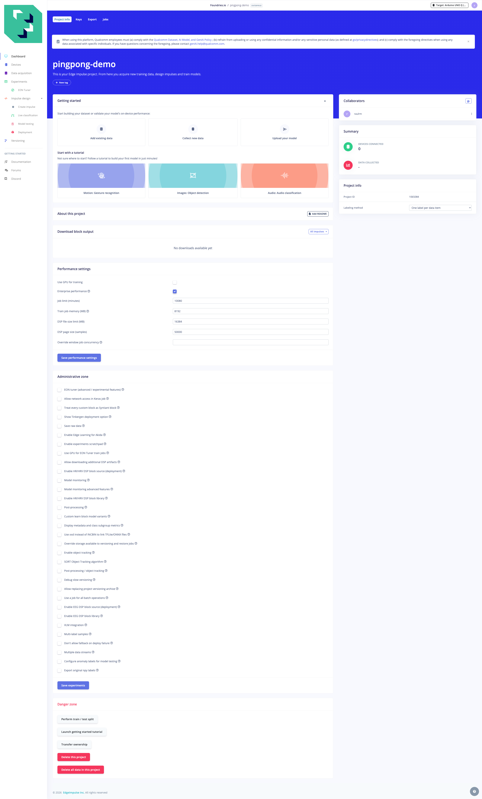
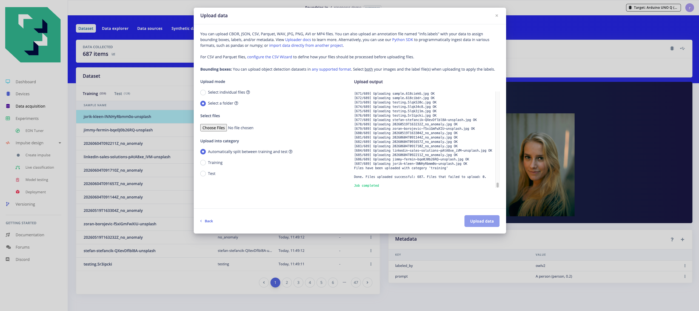
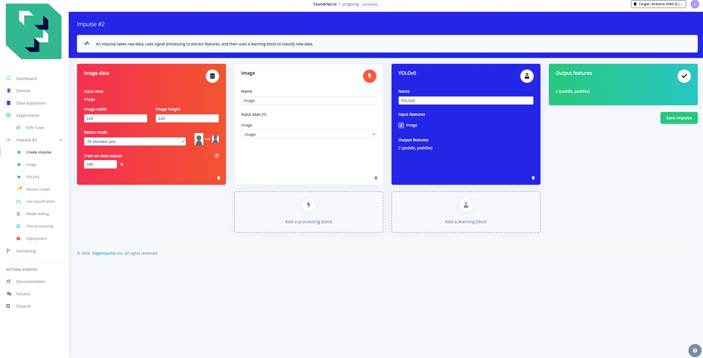
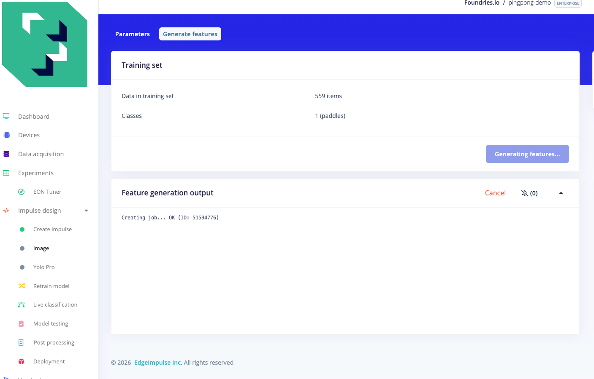
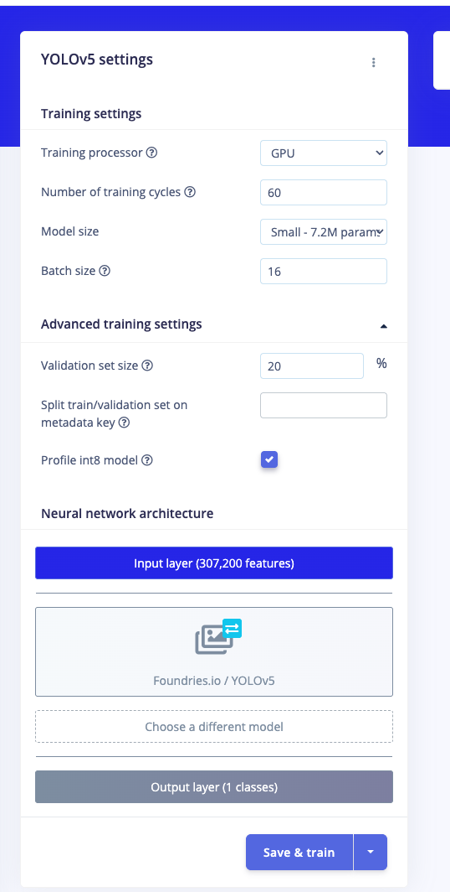
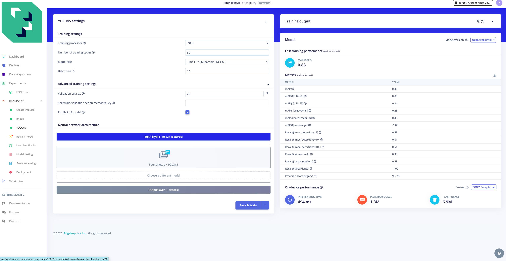

# Teaching a Qualcomm chip to spot a ping-pong paddle

*A practical journey through edge AI — from first dataset photo to live NPU inference,
with two paths: the easy one and the one that teaches you everything.*

---

A tiny glossary for newcomers:

- **Dataset** — example photos plus the answer for each one.
- **Model** — the program that learns patterns from the dataset.
- **Training** — showing examples to the model until it improves.
- **Inference** — using the trained model on a new image.
- **CPU** (Central Processing Unit) — the general-purpose processor every computer has.
- **NPU** (Neural Processing Unit) — a dedicated processor built to run AI workloads faster and with less power.
- **Bounding box** — a rectangle drawn around an object in a photo, marking where it is.

---

## What this is about

I wanted a Qualcomm IQ-8275 EVK edge board — the class of processor that goes into
industrial cameras, smart retail equipment, autonomous vehicles, and robotics platforms —
to look at a live video feed and draw a box around a ping-pong paddle in real time.

Simple to describe. Less simple to do. And the *how* you get there turns out to be
more instructive than the destination.

There are two paths to that destination. This story covers both.

---

## Chapter 0 — The fast path: Edge Impulse

*This chapter covers the easiest way to go from "I have images" to "it runs on the NPU."
If you want to understand what is happening under the hood, keep reading past this chapter.
If you just want it to work, this is your chapter.*

**[Edge Impulse](https://edgeimpulse.com)** (now a Qualcomm product) is a machine-learning
platform built precisely for edge-hardware AI deployment. Instead of writing training code,
configuring quantization pipelines, and cross-compiling C++ daemons, you work through a
browser UI and download a file that runs directly on your board. The headline result of
this chapter: **2 ms inference on the NPU** without writing a single line of training code.

### Dataset collection and labelling

One of Edge Impulse's most useful features is its data collection and labelling toolchain.
Before any model can be trained, you need a dataset: photos of the object, each annotated
with a rectangle showing where the object is.

Edge Impulse Studio's **Data acquisition** tab handles this end-to-end: you can record
directly from a connected device, upload existing images, and draw bounding boxes in the
browser with a simple drag tool. That is exactly how the dataset for this project was
built — roughly 670 images labelled directly in the Studio, no external tool required.

The platform also lets you export your dataset in its own format and re-import it into
a new project at any time, with all bounding boxes and the train/test split intact.

### Running the full pipeline

**1. Create a project.**

Log in to [Edge Impulse Studio](https://studio.edgeimpulse.com), click **Create new project**,
and name it. The project type is set later when you add the learning block.



**2. Upload the dataset.**

Go to *Data acquisition → Add data → Upload data*, set upload mode to **Select a folder**,
and choose the `pingpong-export/` folder. The `info.labels` manifest file inside it
preserves every bounding box and the original train/test split. 559 training images and
128 test images appear fully labelled in seconds.



**3. Build the impulse.**

In *Impulse design*, add an *Image* input (320 x 320, RGB), an *Image* processing block,
and a **YOLOv5** object-detection learning block.



**4. Generate features.**

Click *Image → Generate features*. The job confirms the dataset is clean:
559 training items, 1 class (`paddles`).



**5. Configure and train.**

Open the YOLOv5 settings, set **GPU**, **Small (7.2M params)**, **60 cycles**,
**pretrained weights on**, **Profile int8 model enabled**, and click **Save & train**.
Training runs on Edge Impulse's servers. Result after ~15 minutes:



**mAP@0.5 = 0.980.** The mAP (mean Average Precision) at IoU threshold 0.5 is the
standard metric for object detectors. It combines precision (how often detections are
correct) and recall (how many real objects were found) into a single number from 0 to 1,
where 1.0 means every object found perfectly, every time. Getting 0.980 means the model
missed almost nothing and had almost no false detections on the 112-image validation set.



**6. Deploy to the board.**

Go to *Deployment*, find **"Qualcomm Dragonwing IQ 8275 EVK (AARCH64 with Qualcomm QNN
(Qualcomm Neural Network))"**, and download the `.eim` file. That file is a self-contained
native binary. No runtime to install separately on the board.

**7. Copy and run.**

```bash
scp pingpong-demo.eim root@<board-ip>:/home/weston/
ssh root@<board-ip> "chmod +x /home/weston/pingpong-demo.eim && /home/weston/pingpong-demo.eim"
```

Benchmark on the IQ-8275 EVK (10 runs):

| Metric | Value |
|---|---|
| Warm-up (first call) | 3 ms |
| Steady-state inference | **2 ms** |
| Equivalent FPS | ~500 fps |

The `.eim` uses the QNN TFLite delegate to place the entire graph on the HTP
(Hexagon Tensor Processor) NPU automatically. No manual quantization. No context binary
compiler. No cross-compile toolchain. Two milliseconds.

> **A note on AI-assisted development.** This path worked cleanly, but not without help.
> The `.eim` binary speaks a custom JSON protocol over a UNIX socket, and the correct
> message key for inference (`classify_shm`) is not in any documentation — it was found
> by searching strings inside the binary itself, with an AI coding agent doing the
> searching. The point is not that it was trivial. It is that the hard parts are handled
> by the platform, and the remaining rough edges are exactly the kind of thing an AI agent
> handles well. More on that later.

---

## Want to understand what just happened?

The `.eim` binary Edge Impulse gave you contains a quantized neural network model, a
custom runtime, and a QNN delegate, all compiled for your chip. In a few browser clicks
and one `scp` you got the same 2 ms result that the manual pipeline (below) reaches after
days of toolchain work. That is what the platform buys you.

But *why* does quantization matter? What is a QNN delegate? Why did plain INT8 silently
break a similar model's confidence scores? What is a context binary, and why does the
AOT-compiled version have zero warm-up while the `.eim` costs 3 ms on the first call?

If those questions interest you, the chapters below answer all of them, by working through
exactly what broke, why it broke, and what the fix revealed.

---

## Part 1 — The dataset: where it all starts

A model is only as good as the examples it learns from. The dataset here is roughly 670
photos of ping-pong paddles in various real-world conditions: different rooms, lighting
levels, distances, and backgrounds. Each photo has a bounding box hand-drawn around the
paddle, or is a "negative" with no paddle at all (which teaches the model what
"nothing here" looks like, and matters as much as the positive examples).

All labelling was done in Edge Impulse Studio's data acquisition interface — the same
tool described in Chapter 0. Whether you take the platform path or the manual one, the
dataset is where you start.

> **The one thing to remember from Part 1:** more varied data beats a cleverer model
> almost every time. This becomes the central lesson of the whole story.

---

## Part 2 — Building a brain from scratch (and why it half-failed)

The first attempt used a custom CNN (Convolutional Neural Network) built from zero: a
small network with a single image input, trained only on those ~670 photos.

It worked on paper. On photos that looked like the training set — person standing back,
good light, full paddle visible — it detected the paddle cleanly. Then a live webcam
pointed at a close-up face in a dim room returned nothing. Not a low-confidence detection.
Nothing.

A diagnostic sequence narrowed the cause:

- Paddle size changed (small, large): no difference. Not a scale problem.
- Close-up face cropped out: suddenly detected. **The face was confusing it.**
- Dim image brightened: confidence jumped. **Darkness hurt too.**

The model had not learned "paddle." It had memorised the training album. That album only
contained well-lit photos of people standing back from the camera. A close-up face in
a dim room was a scene it had never encountered, and it had no idea what to do.

Accuracy score: roughly **0.56** (out of 1.0, where 1.0 is perfect).

> **The one thing to remember from Part 2:** a model trained on a narrow dataset
> memorises, it does not generalise. It looks capable until the world shows it something
> outside the album.

---

## Part 3 — Fine-tuning a giant's shoulders

The fix: don't start from zero. Researchers have trained enormous networks on millions of
everyday photos — every lighting, every distance, every scene imaginable. One freely
available family is **YOLO** ("You Only Look Once"), a detector that spots objects in a
single pass through an image.

The version used here: **YOLOv8n** (nano — the smallest variant, deliberately, because
it has to fit on an edge chip later). It already understands edges, shapes, hands holding
objects, and what foreground-versus-background means. All it needed to learn was the
final step: *this specific shape is called a paddle*. That fine-tuning step used the same
~670 photos and ran in under an hour on a Mac.

Result: **mAP@0.5 = 0.979**. And it found the paddle in the close-up-face-in-a-dark-room
scene that had completely stumped the from-scratch model.

Same photos. Same computer. Same effort. The only change: starting from a model that had
already seen the world.

> **The one thing to remember from Part 3:** don't build from zero when a pre-trained
> model has already done 99% of the work for free. Fine-tuning is almost always the right
> starting point.

---

## Part 4 — Watching it live

A score in a table is abstract. A live video with a box drawn around the paddle as it
moves is proof. A small web server opens the camera, runs each frame through the model,
paints the bounding box, and serves the result as an MJPEG (Motion JPEG) stream in a
browser tab. You pick the camera, click start, wave the paddle, and the box follows.

The useful design decision: the server does not know which model is running. Whether it
is the from-scratch CNN, YOLOv8n on CPU, or eventually the NPU on the edge board, the
video layer never changes. Swapping the engine is one line. That decoupling made every
subsequent step much easier.

---

## Part 5 — Moving to the Qualcomm board

Training stays on the Mac (PyTorch with the GPU backend). Inference moves to the
**IQ-8275 EVK**. The bridge is **ONNX (Open Neural Network Exchange)** — a portable model
format the board can read without the full training stack installed.

Running on the board's CPU delivered roughly 24 fps. Smooth enough. But the board has an
NPU sitting right there, doing nothing. That processor exists precisely for this kind of
workload.

---

## Part 6 — The NPU, the trap, and the lesson that made it worth it

Getting a model onto Qualcomm's HTP NPU requires the **QAIRT** (Qualcomm AI Runtime SDK)
toolchain. The chip achieves its speed by using compact integer arithmetic instead of
floating-point. That rounding process is called **quantization**.

### The INT8 trap

First attempt: quantize everything to 8-bit integers (INT8 — 8-bit Integer). The model
loaded. It found the paddle. But the confidence score — the number between 0 and 1 that
says "I am 87% certain this is a paddle" — **collapsed to zero** on every detection.
Technically found, practically useless.

The cause is a subtle arithmetic collision: bounding-box coordinates are large numbers
(like 400, 580 pixels). Confidence scores are tiny numbers (0.87). Forcing both through
the same 8-bit scale — calibrated to handle the large coordinates — crushes the delicate
confidence values into nothing.

The fix: **A16W8** (16-bit Activations, 8-bit Weights). Keep the weights at 8-bit
(compact), but let the in-flight numbers use 16-bit precision. That extra range protects
the confidence score. After this change, the NPU reported a healthy 87% confidence
immediately.

The QAIRT pipeline that produces this:

1. `qairt-converter`: ONNX → floating-point DLC (Deep Learning Container)
2. `qairt-quantizer`: DLC → A16W8 DLC, with calibration images
3. `qnn-context-binary-generator`: DLC → chip-specific context `.bin`

The `.bin` is compiled ahead-of-time for the exact HTP version on this board. No JIT
warm-up, no portability, but maximum speed and zero first-call cost.

### The benchmark surprise

Raw NPU math: **1.74 ms per inference** vs **145 ms on CPU** — 84 times faster. The live
stream should fly.

It did not, at first. The end-to-end measurement showed the NPU version at ~57 ms per
frame vs ~42 ms on CPU. The 84x-faster engine was losing the race.

The culprit: **format conversion**. The NPU expects compact 16-bit integers. The camera
delivers 32-bit floats. Converting 307,200 numbers per frame was happening one number at
a time on the CPU. That was the missing 30 ms.

Fix: convert the entire frame at once using a vectorised math call (under 0.5 ms), then
hand the chip exactly the bytes it expects.

After that fix: **NPU: 25 ms/frame vs CPU: 42 ms/frame — a real 1.7x end-to-end win**.

> **The one thing to remember from Part 6:** a faster engine only wins if the road to it
> is not the bottleneck. The NPU was 84x faster from the start. The win only appeared
> after fixing the format conversion that fed it one number at a time.

---

## Part 7 — The daemon: keeping the NPU resident

Measuring with `qnn-net-run` (the QAIRT command-line tool) includes ~150 ms of
process-startup overhead per call. For a live application you want the model *resident*:
loaded once, accepting frames forever.

The solution: a C++ daemon that holds the QNN context in memory, reads raw frames from a
named FIFO pipe, runs inference, and pushes results back, while a second thread encodes
and streams MJPEG over HTTP. The browser tab stays live. The NPU never unloads between
frames.

The 25 ms/frame number above comes from this architecture: frame arrives via FIFO, format
conversion in ~0.2 ms, NPU runs in ~1.74 ms, bounding box decodes, HTTP encoder picks it
up. End to end: ~25 ms, about 40 fps.

---

## Part 8 — The comparison

| | Manual pipeline (Parts 2 to 7) | Edge Impulse (Chapter 0) |
|---|---|---|
| Model | YOLOv8n, 3.2M params | YOLOv5 Small, 7.2M params |
| Quantization | A16W8 (manual recipe) | INT8 via QNN TFLite delegate |
| mAP@0.5 | **0.979** | **0.980** |
| NPU inference | **~2 ms** (daemon, resident) | **2 ms** (JIT delegate) |
| Warm-up cost | None (AOT, context pre-loaded) | 3 ms (JIT on first call) |
| Path to get here | Parts 2 to 7 of this story | Chapter 0 |
| Reproducible with | [REPRODUCE.md](../docs/REPRODUCE.md) | [QUICKSTART_EI.md](QUICKSTART_EI.md) |

The platform matched every metric that matters. 2 ms either way, mAP within 0.001.

The gap is in the journey. The manual pipeline required a cross-compile toolchain, a
quantization recipe, a C++ daemon, and a week of debugging. Edge Impulse required a
browser and an afternoon.

Why does the manual path exist in this story? Because taking it taught things the
platform hides:

- Why INT8 silently breaks a detector's confidence score, and how A16W8 fixes it.
- Why a chip that is 84x faster at raw math can lose an end-to-end race, and what
  actually determines the winner.
- That JIT warm-up (3 ms) and AOT startup (0 ms) are different deployment trade-offs,
  not just different tools.
- That hardware sometimes needs a full power cycle, not a replug, and other unglamorous
  realities no platform abstracts away.

---

## A note on how this was built

This project was not built by one person in isolation. An **AI coding agent (Claude Code)**
was the co-pilot throughout: writing scripts, explaining toolchain errors, running
benchmarks on the board over SSH, interpreting quantization failures, and finding the
correct UNIX socket protocol for the `.eim` binary when no documentation existed.

That last point deserves a moment. When the `.eim`'s `classify` message returned
"Failed to handle message," the agent found `classify_shm` by reading strings inside the
binary itself, then reasoning about which matched the expected message pattern. It was not
magic — it was methodical search through a tool the agent happened to know how to use.

If you are reproducing this project, use an AI agent. The QAIRT toolchain has sharp edges
and error messages that require domain context to decode. AI assistance does not make hard
things trivial. It makes them tractable in an afternoon rather than a week. You do not
need to be a specialist to get started — and the platform path (Chapter 0) proves it: the
hardest thing there was finding one undocumented message key.

---

## The lessons, short version

1. **Data is your ceiling.** A few hundred similar photos produce a memoriser, not a
   generaliser. More varied data beats a cleverer model.

2. **Start from a pre-trained model.** Fine-tuning YOLOv8n took mAP from 0.56 to 0.979
   with the same dataset and the same training time.

3. **Measure the whole pipeline honestly.** The NPU was 84x faster at math but lost the
   end-to-end race until the format-conversion bottleneck was fixed.

4. **The bottleneck is rarely where you expect.** Not the chip, not the disk — one-at-a-
   time format conversion on the CPU. Fix the road, and the fast engine wins.

5. **The platform and the manual path give the same answer.** Edge Impulse reaches 2 ms
   in an afternoon. The manual path reaches 2 ms in a week and teaches you why.

---

## Go further

- **The easy path — copy-paste instructions:**
  [QUICKSTART_EI.md](QUICKSTART_EI.md)

- **The deep dive — every command, every script:**
  [REPRODUCE.md](../docs/REPRODUCE.md)
