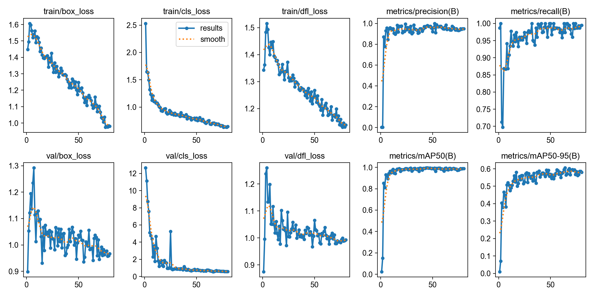
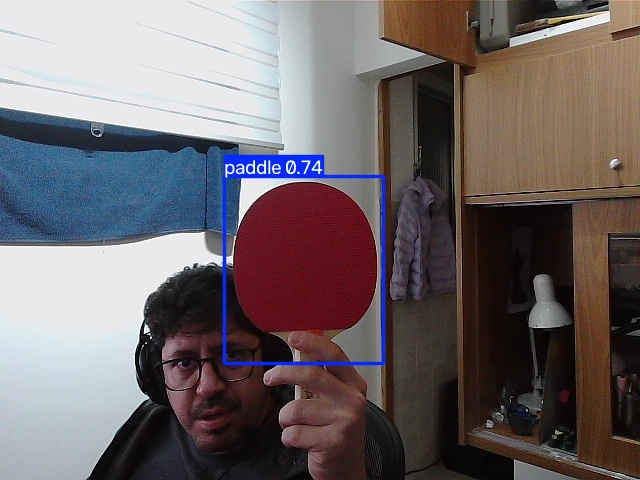

# Reproduce it yourself, end to end

This is the full, no-steps-hidden guide, from an empty folder to live paddle detection on
a Qualcomm NPU. No prior AI experience assumed. Every command is here; every script it
calls is in this repo with English comments.

**Phases A and B (Steps 1–6) are copy-paste** on a Mac + the board. **Phases C and D
(Steps 7–9)** — the Qualcomm NPU part — need the (free) QAIRT SDK, an x86 Linux box, and a
little comfort editing paths in a shell script; they're a *worked reference* rather than
turnkey. Each of those steps says exactly what it assumes.

**What you'll go through:**

1. [Build a dataset](#step-1)
2. [Set up the Mac training environment](#step-2)
3. [Phase A — train a CNN from scratch](#step-3) *(the baseline that teaches the lesson)*
4. [Phase B — fine-tune YOLOv8n](#step-4) *(the one that actually works)*
5. [Run it live in a browser on the Mac](#step-5)
6. [Run it on the Qualcomm board's CPU](#step-6)
7. [Convert the model for the Qualcomm NPU](#step-7)
8. [Run it on the NPU — one-shot, then live via a C++ daemon](#step-8)
9. [Benchmark CPU vs NPU honestly](#step-9)

> **The golden rule of this project:** *train on the big computer, run on the little
> one.* All training happens on a Mac (PyTorch + Apple's MPS/Metal). All inference —
> first on CPU, then NPU — happens on the board.

### The four big moves (the mental map)

Nine steps sounds like a lot. It's really just **four moves**, and the thing that trips
people up most — *which machine am I on right now?* — is answered in the third column.
Keep this table in mind and every step has an obvious home:

| Move | What happens | Where it runs | Steps |
|------|--------------|---------------|-------|
| **1. Get the data** | collect photos, draw a box on each | your computer (Edge Impulse) | 1–2 |
| **2. Train on the Mac** | teach the model, export it to ONNX | **Mac** (PyTorch/MPS) | 3–4 |
| **3. Run live on CPU** | webcam → detection → browser | **Mac first, then the IQ-8275 CPU** | 5–6 |
| **4. Accelerate on the NPU** | convert the model, run it on the AI chip | **x86 Linux (convert) + board (run)** | 7–9 |

Moves 1–3 (Steps 1–6) are **copy-paste** on a Mac and the board. Move 4 (Steps 7–9) is
the Qualcomm NPU part — a *worked reference* that needs the free QAIRT SDK and an x86
Linux box. Every step below says exactly which machine it assumes.

---

## What you need

**Hardware**
- A Mac with Apple Silicon (M1/M2/M3…) for training. (Any machine with PyTorch works;
  the `--device mps` flag is Mac-specific — use `cpu` elsewhere.)
- A **Qualcomm IQ-8275 EVK** board (QCS8300, Hexagon **V75** NPU), or a similar
  Qualcomm board. It runs Linux, aarch64, Python 3.14, with `onnxruntime` preinstalled.
- A USB webcam for the live demo. (Mine was an EMEET SmartCam; on the board it showed up
  as `/dev/video26`.)
- An **x86-64 Linux machine** to run Qualcomm's conversion toolkit (the QAIRT SDK is
  x86-only). This can be any Linux box/VM.

**Software**
- On the Mac: Python 3, `git`.
- On the x86 Linux box: Qualcomm's **QAIRT SDK** (I used v2.47.0.260601), a free download.
  It contains `qairt-converter`, `qairt-quantizer`, `qnn-context-binary-generator`, and
  `qnn-net-run`. [Step 7.0](#step-7) has the exact download + install commands.
- To build the live-NPU C++ daemon: an aarch64 cross-compiler
  (`aarch64-linux-gnu-g++-13`). [Step 8](#step-8) covers this.

**Known-good versions from a full reproduction**
- Python 3.9 on macOS for training/export, Python 3.14 on the board for inference.
- Ultralytics 8.4.94, ONNX 1.19.x/1.22.x, onnxruntime 1.19.x on Mac and 1.27.x on the board.
- QAIRT SDK 2.47.0.260601.
- Qualcomm Hexagon HTP target: **V75** (`"htp_arch": "v75"`).

---

## Step 1 — Build a dataset<a name="step-1"></a>

The dataset is the foundation. You need images of the object (paddle) with a box drawn
around it in each, plus some background images with no paddle.

**The easy path (what I used): [Edge Impulse](https://edgeimpulse.com).** It's a free
web tool where you upload images/video, draw bounding boxes in the browser, and export.
Choose the **"Object Detection"** project type and export in the format that gives you,
per split, a folder of images plus a `bounding_boxes.labels` JSON file.

Aim for a few hundred labeled images with **variety**: different distances, angles,
rooms, and lighting. Include ~10–20% background frames with no paddle. Variety matters
more than raw count — Phase A fails precisely because its images weren't varied enough.

You'll end up with an export folder like this (this repo's code expects exactly this):

```
pingpong-export/
  training/
    <image>.jpg ...
    bounding_boxes.labels     # JSON: filename -> list of {label, x, y, width, height}
  testing/
    <image>.jpg ...
    bounding_boxes.labels
```

The label boxes are in **absolute pixels**, with `x,y` = the **top-left corner**.
Remember that — different tools use different conventions, and getting it wrong silently
ruins training. `training/labels.py` is the single place that reads this format; every
other script goes through it.

> **What this does:** turns one hand-drawn box into the numbers the network learns.
> **Why it matters:** a box on screen is a corner + a width in pixels; a network trains
> better on a **center point** that's **normalized 0–1** (independent of image size).
> This exact conversion is reused in Phase B and again for NPU calibration — get it right
> once, everywhere benefits.
> **In the code:** `training/preprocess.py:box_to_target()`
> ```python
> cx = (box.x + box.w / 2.0) / img_w      # top-left x  ->  center x, as a fraction
> cy = (box.y + box.h / 2.0) / img_h
> w  = box.w / img_w                       # size, also as a fraction of the image
> h  = box.h / img_h
> return np.array([1.0, cx, cy, w, h])     # 1.0 = "a paddle is present here"
> ```

---

## Step 2 — Mac training environment<a name="step-2"></a>

```bash
git clone https://github.com/munoz0raul/pingpong-qualcomm.git
cd pingpong-qualcomm

# Put your Edge Impulse export here (the code looks for training/ and testing/ inside it):
#   pingpong-qualcomm/pingpong-export/training/...
#   pingpong-qualcomm/pingpong-export/testing/...
```

If you have the Edge Impulse zip file, unpack it like this:

```bash
mkdir -p pingpong-export
unzip /path/to/pingpong-export.zip -d pingpong-export
```

Sanity-check the dataset before training. For the dataset used in this write-up you should see
`539` training images and `124` testing images:

```bash
python3 training/labels.py
# expected:
# [training] 539 images  |  with paddle: 295  |  background: 244
# [testing] 124 images   |  with paddle: 76   |  background: 48
```

We use **two separate virtual environments** on purpose: Phase A (a lean PyTorch setup)
and Phase B (Ultralytics/YOLO, which pulls in a lot more). Keeping them apart means
Phase A stays reproducible even after you install the heavier YOLO stack.

```bash
# Phase A environment
python3 -m venv training/.venv
training/.venv/bin/python -m pip install -r training/requirements.txt
```

> **Why `python -m pip` and not `pip`?** On some Macs (notably the Python that ships with
> Xcode Command Line Tools) `venv` creates the environment but *not* a `bin/pip` shortcut,
> so `training/.venv/bin/pip` gives "No such file or directory". Calling pip as a module —
> `.../bin/python -m pip` — always works, on every Python. Same command everywhere else in
> this guide: prefer `bin/python -m pip` over `bin/pip`.

---

## Step 3 — Phase A: a CNN from scratch (the instructive baseline)<a name="step-3"></a>

This phase builds a small neural network with no pre-training and teaches it only on your
paddle photos. **It will underperform** — that's the point. It's the control group that
proves why Phase B is worth it.

The pipeline is four independent scripts: **preprocess → train → eval → export**.

### 3.1 Preprocess (decode images once, cache to disk)

Decoding JPEGs every training epoch is slow. `preprocess.py` decodes each image once,
crops/resizes it to 320×320, and caches the result as a `.npy` array. It also converts
each label box into the network's target format — `[present, cx, cy, w, h]`, where the
center `cx,cy` and size `w,h` are **normalized 0–1** (this normalization, in
`box_to_target()`, is reused everywhere later).

```bash
training/.venv/bin/python training/preprocess.py
```

It finds the export on its own (through `labels.py`, which knows the `pingpong-export/`
layout) and caches both splits. Add `--force` to rebuild an existing cache, or
`--splits training testing` to pick specific splits.

> **What this does:** reads every JPEG once, resizes to 320×320, and saves the whole set
> as one big `.npy` array (plus the target boxes as a second array).
> **Why it matters:** training shows the model every image ~20 times (once per epoch).
> Decoding JPEGs 20× is minutes of wasted work; decoding once into a memory-mapped array
> makes every later epoch nearly free. This is the single biggest speedup in Phase A.
> **In the code:** `training/preprocess.py:build_cache()`
> ```python
> images  = np.zeros((n, IMG_SIZE, IMG_SIZE, 3), dtype=np.uint8)
> targets = np.zeros((n, TARGET_DIM), dtype=np.float32)   # all-0 row = background
> # ... for each sample: cv2.imread -> resize -> images[i] = resized
> #     and box_to_target(box) -> targets[i]   (the conversion from Step 1)
> ```

### 3.2 Train

```bash
training/.venv/bin/python training/train.py --epochs 20
```

Key design choices, all in `train.py` with comments explaining why:

- **`pick_device()`** uses Apple's **MPS** (Metal GPU) if present, else CPU.
- **Temporal split, not random:** the first 80% of frames are training, the last 20% are
  validation. Video frames next to each other are near-identical; a random split would
  leak almost-copies into validation and give a dishonestly high score.
- **Balanced accuracy + weighted loss** so the model can't cheat by always guessing the
  majority class.
- Prints `val_IoU` every epoch and saves the best model + `metrics.json` under
  `training/checkpoints/`.

> **What this does:** defines the tiny "brain" and what it outputs for one image.
> **Why it matters:** this is a network built **from scratch** — no pre-training. It has
> two heads: one says *is a paddle here?* and one says *where?* Its whole output is just
> **5 numbers**. Compare that to YOLO in Phase B, which starts from a model that already
> saw millions of images — the contrast is the lesson of the project.
> **In the code:** `training/model.py:PaddleDetNet.forward()`
> ```python
> obj = self.obj_head(...)      # (B, 1)  "paddle present?"  (raw logit)
> box = torch.sigmoid(...)      # (B, 4)  cx, cy, w, h  in [0,1]
> return torch.cat([obj, box], dim=1)   # (B, 5) = [present, cx, cy, w, h]
> ```
> `val_IoU` (in `train.py:boxes_iou()`) measures how well those 4 box numbers overlap the
> true box — 0 = miss, 1 = perfect. `pick_device()` puts all this on the Mac's MPS/Metal GPU.

### 3.3 Read the result

There is no separate eval script in Phase A — `train.py` evaluates on the validation
split every epoch and prints it live. Watch the `val_IoU` figure: it's the honest quality
measure for a box (Intersection-over-Union: how much the predicted box overlaps the true
one, 0=miss, 1=perfect). It tops out around **IoU 0.56**. The full history is saved to
`training/checkpoints/metrics.json`, and the best checkpoint to
`training/checkpoints/best.pt`.

### 3.4 Export to ONNX (the portable format for the board)

```bash
training/.venv/bin/python training/export_onnx.py \
    --ckpt training/checkpoints/best.pt --out training/checkpoints/best.onnx
```

**ONNX** is a framework-neutral file the board can run without PyTorch installed. Opset
17 — supported by both `onnxruntime` and the Qualcomm tools.

### 3.5 Watch it fail (the valuable part)

Now *see* the weakness with your own eyes. The same web server you'll use in Step 5 also
serves the Phase A model — just pass `--model cnn`:

```bash
# Phase A's own venv already has everything the server needs (opencv, onnxruntime).
training/.venv/bin/python web/server.py --model cnn
# open http://localhost:8080 , pick your camera, hit "start"
```

Point a webcam at yourself, lean in close in a dim room. It won't find the paddle.
Diagnose it like we did: crop your face out of the frame → it suddenly works; brighten
the frame → the score rises. **Conclusion: the tiny model memorized its training domain
(distant, well-lit, full-body scenes) and can't generalize to a big close-up face in low
light.** That's the motivation for Phase B.

> ⚠️ **Always press "stop" in the browser before closing the tab** (same as Step 5). If
> you don't, the camera stays locked open. There's a guard that releases it anyway, but
> stopping cleanly is the habit.

---

## Step 4 — Phase B: fine-tune YOLOv8n (the one that works)<a name="step-4"></a>

Instead of building from zero, we start from **YOLOv8-nano**, pre-trained on the COCO
dataset (millions of images, people and faces at every scale and lighting), and
**fine-tune** it on our few hundred paddle photos. It inherits all that visual robustness
for free.

### 4.1 Environment

```bash
python3 -m venv yolo/.venv
yolo/.venv/bin/python -m pip install -r yolo/requirements.txt   # ultralytics + onnx + onnxruntime
```

(If `yolo/.venv/bin/pip` reports "No such file or directory", that's the Xcode-Python quirk
from Step 2 — the `python -m pip` form above sidesteps it.)

### 4.2 Convert labels to YOLO format

YOLO wants, per image `foo.jpg`, a text file `foo.txt` with one line per object:
`<class> <cx> <cy> <w> <h>`, all normalized 0–1 with the **center** (not the corner).
`prep_yolo.py` reads your Edge Impulse export through the same `labels.py` and writes it
out, plus a `data.yaml` describing the dataset.

```bash
yolo/.venv/bin/python yolo/prep_yolo.py
# sanity check: draws boxes back onto images so you can eyeball the conversion
yolo/.venv/bin/python yolo/prep_yolo.py --check
```

Your Edge Impulse dataset export already comes split into two folders — `training/` (photos
the model learns from) and `testing/` (photos it never sees during training, used only to
score it). `prep_yolo.py` keeps that split: `training/`→YOLO `train`, `testing/`→YOLO `val`
(no leakage — a test photo sneaking into training would inflate the score into a lie). Background
images (no paddle) get an **empty** `.txt` — YOLO uses those as negatives.

> **What this does:** rewrites the same boxes into the layout YOLO's trainer expects.
> **Why it matters:** it's the *same math as Step 1* (`cx=(x+w/2)/W`, normalized) — YOLO
> just wants it in a per-image text file instead of a `.npy` array. One line per paddle:
> ```
> 0 0.512 0.478 0.230 0.310      # class cx cy w h — all 0..1, center-based
> ```
> A background image (no paddle) becomes an **empty** `foo.txt`. That's not a bug — an
> empty file is how YOLO is told "nothing here, learn from it too."

### 4.3 Fine-tune

```bash
# Apple Silicon Mac (default, uses Metal/MPS):
yolo/.venv/bin/python yolo/train_yolo.py --epochs 80 --device mps

# If you are reproducing on Linux/Ubuntu without a GPU, use CPU instead:
# yolo/.venv/bin/python yolo/train_yolo.py --epochs 80 --device cpu

# If you are reproducing on Linux with an NVIDIA GPU, use CUDA device 0:
# yolo/.venv/bin/python yolo/train_yolo.py --epochs 80 --device 0
```

- **`imgsz=320`** matches Phase A and what we'll run on the board. Ultralytics letterboxes
  (pads to a square with gray borders) so any camera resolution fits without distortion.
- **Free augmentation:** Ultralytics automatically applies mosaic, HSV (brightness/color)
  jitter, and flips — which directly attacks the lighting/framing problem that killed
  Phase A.
- Result lands in `yolo/runs/paddle/weights/best.pt`, plus loss/mAP curves and a
  confusion matrix in `yolo/runs/paddle/`.

The score here is **mAP@0.5** (the standard detection metric). Phase B reaches
**mAP@0.5 ≈ 0.98** — versus IoU 0.56 for the from-scratch CNN.

> **What this does:** takes YOLOv8n's COCO-pretrained weights and nudges them to recognize
> *your* paddle — this is **transfer learning**, the heart of Phase B.
> **Why it matters:** Phase A started from random weights and only ever saw ~300 paddle
> photos, so it memorized them. YOLO starts from a model that already saw millions of
> images (people, faces, objects at every scale and light), so fine-tuning only has to
> teach one new word — "paddle" — and inherits all that robustness for free. That's the
> whole reason it works in the dim-room-close-up-face scene that blinded the CNN.
> **In the code:** `yolo/train_yolo.py:main()`
> ```python
> from ultralytics import YOLO
> model = YOLO("yolov8n.pt")          # download COCO-pretrained weights (once)
> model.train(data=DATA_YAML, epochs=80, imgsz=320, device="mps",
>             name="paddle", plots=True)   # -> runs/paddle/weights/best.pt
> ```
> `imgsz=320` matches Phase A and the board; `device="mps"` uses the Mac's Metal GPU.
> Ultralytics auto-applies mosaic + brightness/flip augmentation — attacking exactly the
> light/framing weakness that killed Phase A.


*Loss falling and mAP climbing over 80 epochs — the model learning "paddle."*

### 4.4 Export to ONNX

```bash
yolo/.venv/bin/python yolo/export_yolo.py   # reads runs/paddle/weights/best.pt -> yolo/best.onnx
```

(It defaults to the `runs/paddle/weights/best.pt` that 4.3 just produced; pass
`--ckpt <path>` to export a different one.)

Important choice: **`nms=False`** — we do **not** bake the final NMS step into the graph.
NMS uses operations not every NPU backend supports. We do decode + NMS in plain numpy in
`web/infer_yolo.py` instead. Philosophy: *the graph does only the convolutions; postprocessing
lives in code.* This is what makes the NPU port clean later. Shape is fixed at
1×3×320×320 (the NPU requires fixed shapes).

> **What this does:** converts the trained `best.pt` into a portable `best.onnx` the board
> can run without PyTorch installed.
> **Why it matters:** the two flags here are deliberate and pay off later. `nms=False`
> leaves the final "remove duplicate boxes" step *out* of the model — because that op isn't
> supported on every NPU — and we do it in numpy instead (see Step 5). `dynamic=False` locks
> the input to a fixed 1×3×320×320, which the NPU requires. Decisions made *now* are what let
> Steps 7–8 just work.
> **In the code:** `yolo/export_yolo.py:main()`
> ```python
> model = YOLO(args.ckpt)             # runs/paddle/weights/best.pt
> model.export(format="onnx", imgsz=320, opset=17,
>              nms=False,             # decode + NMS live in numpy, not the graph
>              dynamic=False,         # fixed 1x3x320x320 — the NPU needs a fixed shape
>              simplify=True)
> ```

### 4.5 Prove the generalization

Grab a hard frame — the kind that killed Phase A: a big face close to the camera, the
paddle nearby, a dim room. Save it as a `.jpg` (mine was `emeet2.jpg`; that exact file
isn't shipped in the repo, so use one you captured yourself). `infer_yolo.py` runs
standalone as a one-image smoke test — the same detector the live server uses, just
pointed at a file:

```bash
yolo/.venv/bin/python web/infer_yolo.py --image /path/to/your_hard_frame.jpg
# prints the box + confidence, and writes an annotated /tmp/yolo_infer_test.jpg
```

On my frame it found the paddle (box ≈ (224,177)-(383,363), confidence ≈ 0.75) — the exact
scene where the CNN scored ~0.00. Thesis proven: the pre-trained model generalizes where
the from-scratch one couldn't. (No hard frame handy? Skip straight to Step 5 and lean into
the camera in a dim room — you'll see the same contrast live.)

> **What this does:** runs the exported `.onnx` on one still image.
> **Why it matters:** this is the payoff of the whole phase, on a single frame. Same hard
> scene, same 320×320 input — the CNN went blind here, YOLO boxes the paddle confidently.
> It also proves your `.onnx` + numpy decode work *before* you move to live video.
> **In the code:** `web/infer_yolo.py` (the `__main__` smoke test) → `PaddleDetector.detect()`
> — the graph emits 8400 candidate boxes, `_nms()` keeps the best; identical to what runs
> per-frame in the browser next.


*The close-up-face, dim-room frame that blinded the from-scratch CNN — YOLOv8n boxes the paddle confidently.*

---

## Step 5 — Live demo in a browser (on the Mac)<a name="step-5"></a>

`web/server.py` is a tiny web server (Python standard library + OpenCV, no framework). It
opens the webcam, runs each frame through a detector, draws the box, and streams the
result to your browser as **MJPEG** (a sequence of JPEGs the browser flips through like
video). It exposes a small API: list cameras, probe supported resolutions, start, stop,
stream.

One server, three engines: `--model cnn` (Phase A), `--model yolo` (Phase B, below), and
`--model npu` (Step 8) all run through *this same file*. You already used `--model cnn`
back in Step 3.5.

```bash
# 'yolo' selects web/infer_yolo.py; 'cnn' would select the Phase A model
yolo/.venv/bin/python web/server.py --model yolo
# open http://localhost:8080 , pick a camera, hit "start"
```

The key architectural trick: **every engine exposes the same `PaddleDetector` interface**
(`.detect()` and `.draw()`). So `infer.py` (CNN), `infer_yolo.py` (YOLO/CPU), and
`infer_npu.py` (YOLO/NPU) are interchangeable — the MJPEG loop in `server.py` never
changes. This one decision makes Steps 6–8 painless.

> **What this does:** the per-frame heartbeat of the whole live demo.
> **Why it matters:** notice there's **nothing model-specific** in this loop. Swapping CNN
> → YOLO → NPU only swaps what `detect()` points at; these exact ~8 lines are what run on
> the board in Steps 6 and 8, unchanged. Write the loop once, reuse it everywhere.
> **In the code:** `web/server.py:_stream()`
> ```python
> while self.state.running:
>     frame = self.state.read()                    # grab a webcam frame
>     det = self.detector.detect(frame)            # <- the only line that differs per engine
>     self.detector.draw(frame, det)               # green box if a paddle was found
>     ok, jpg = cv2.imencode(".jpg", frame, ...)   # encode and push to the browser
>     self.wfile.write(b"--frame\r\n" ... jpg.tobytes())
> ```
> Inside YOLO's `detect()` (`web/infer_yolo.py`) the graph outputs 8400 candidate boxes;
> plain-numpy `_nms()` throws away the overlapping duplicates and keeps the best — the
> postprocessing lives in code, not in the model (this is what keeps the NPU port clean).

> ⚠️ **Always press "stop" in the browser before closing.** If you don't, the camera
> device stays locked open and won't reopen. (We added a guard so `/api/cameras` reports
> the in-use camera instead of failing to re-probe a locked device — but stopping cleanly
> is the habit.)

---

## Step 6 — Run on the Qualcomm board's CPU<a name="step-6"></a>

Now move to the board. First find its IP address. From the board's serial console or
local terminal:

```bash
ip addr show end0    # Ethernet
ip addr show wlp1s0  # Wi-Fi, if configured
```

In my setup the board was `192.168.15.86` (user: `root`; password comes with the EVK image).
From the Mac, create the target folders and copy the model and `web/` code:

```bash
BOARD_IP=192.168.15.86
ssh root@$BOARD_IP 'mkdir -p /opt/pingpong/yolo /opt/pingpong/web'
scp yolo/best.onnx  root@$BOARD_IP:/opt/pingpong/yolo/
scp web/*.py        root@$BOARD_IP:/opt/pingpong/web/

ssh root@$BOARD_IP
```

The board already has `onnxruntime` (Python 3.14, aarch64). Because inference is just
`onnxruntime` with the `CPUExecutionProvider`, and the pre/post-processing is byte-identical
to the Mac, **what you validated on the Mac is literally what runs here**. Only the camera
index and the capture backend change.

```bash
# on the board — v4l2 backend is required on Linux (the default GStreamer backend
# breaks when you change resolution after opening)
cd /opt/pingpong
python3 web/server.py --model yolo --cameras 26 --backend v4l2 --port 8080
# open http://192.168.15.86:8080 from any machine on the network
```

You'll get ~24 FPS end-to-end on the CPU. That's your **CPU baseline**.

> 🔌 **Real-world gremlin:** if the USB camera disappears (gone from `lsusb`, `/dev/video26`
> missing), a hot-replug won't bring it back — it resets the USB hub. **Reboot the board.**
> Hot-plug fails; reboot works.

---

## Step 7 — Convert the model for the Qualcomm NPU<a name="step-7"></a>

This is where the tutorial **switches computers**. Steps 1–6 ran on the Mac (and the board).
Step 7 runs on an **x86-64 Linux machine** with the QAIRT SDK — the NPU compiler only exists
for x86 Linux. So the flow is: you *trained* `best.onnx` on the Mac (Step 4.4), and now you
carry it over to the x86 box to compile it for the NPU. The scripts are in `npu/`; the two
machines and what runs where are called out at each sub-step below.

> ⚠️ **What's different about Steps 7–8.** Unlike Phases A/B, these need extras the tutorial
> can't ship for you: the (free) **QAIRT SDK**, an **x86-64 Linux box** to run it, and — to
> rebuild the live daemon — an aarch64 cross-compiler. But you no longer hand-edit each
> script. All the machine-specific paths live in **one file, `npu/env.sh`**, which every
> `npu/*.sh` script sources. Better: if you `export QW=<work dir>` at the top of 7.0 (below),
> `env.sh` derives everything from it and you **edit nothing** — the only exception is `R`
> (the cross-compiler), needed just for the daemon in [Step 8.2](#step-8). Two honest caveats
> remain: the SDK is a separate download, and rebuilding the C++ daemon needs the SDK's
> SampleApp source tree overlaid (spelled out in Step 8.2).

**7.0 — Install the QAIRT SDK** (on the x86 Linux box, once).

The QAIRT SDK is Qualcomm's NPU toolkit — it holds `qairt-converter`, `qairt-quantizer`,
and `qnn-context-binary-generator`. It's a free download (the **Community edition** needs no
login or QPM). Match the version to your board's runtime; mine reported
`QNN SDK v2.47.0.260601`, so I used the exact same SDK version.

Pick a working directory with real disk space (**not** a quota-limited `$HOME` — the SDK
unzips to ~4 GB). I used a scratch dir on the build server; anywhere writable is fine.

```bash
# Set your work dir ONCE — the rest of this step is copy-paste. Pick a spot with real disk
# (~4 GB free); NOT a quota-limited $HOME. Everything below uses $QW, so change only this line:
export QW=/local/mnt/workspace/qairt-work    # <-- EDIT this to your work dir

# 0) Clone this repo on the x86 box — the npu/*.sh scripts and npu/env.sh live here:
mkdir -p "$QW" && cd "$QW"
git clone https://github.com/munoz0raul/pingpong-qualcomm.git

# 1) Download + unzip the Community edition (this is the exact version I used):
wget https://softwarecenter.qualcomm.com/api/download/software/sdks/Qualcomm_AI_Runtime_Community/All/2.47.0.260601/v2.47.0.260601.zip
unzip v2.47.0.260601.zip     # -> creates ./qairt/2.47.0.260601/  (this folder is your SDK path)
```

**2) Create the Python venv.** On a stock Ubuntu the built-in `python3 -m venv` is often
broken (`ensurepip is not available`, needs `sudo apt install python3-venv`). Without sudo,
use `virtualenv` instead — this is the reliable path, not a fallback:

```bash
pip install --user --break-system-packages virtualenv   # no sudo needed
python3 -m virtualenv .venv
source .venv/bin/activate
```

**3) Install the Python deps — in this exact order and with these versions.** The SDK's
`check-python-dependency` only *verifies* packages, it does **not** install `onnx`, and
recent `onnx`/`numpy` break the SDK's native code. These are the versions that work:

```bash
python3 qairt/2.47.0.260601/bin/check-python-dependency   # installs ~30 support packages
pip install "numpy==1.26.4" "onnx==1.16.1" "onnxruntime==1.18.1"
```

> **Why these pins (each one is a real failure I hit reproducing this from scratch):**
> - `numpy==1.26.4` — numpy 2.x breaks the SDK's native `.so` files.
> - `onnx==1.16.1` — newer `onnx` (e.g. 1.22) drops the `onnx.version.version` attribute the
>   converter reads → `AttributeError: module 'onnx' has no attribute 'version'`.
> - `onnxruntime==1.18.1` — matches the pinned `onnx`.

**4) Give the SDK the LLVM runtime libs it needs.** The SDK's native tools are built against
LLVM's `libc++`, which a clean Ubuntu box does **not** ship and the SDK does **not** bundle —
so out of the box you get `libc++.so.1: cannot open shared object file`. Fetch them without
sudo and stage them in one dir:

```bash
cd /tmp
# NOTE: use the *versioned LLVM* packages — they ship the .so.1 files under llvm-18/lib.
# (The plain libc++1 / libunwind8 packages are the wrong ones: stubs, or the system .so.8.)
apt-get download libc++1-18 libc++abi1-18 libunwind-18   # no install, just fetch the .debs
for d in libc++1-18_*.deb libc++abi1-18_*.deb libunwind-18_*.deb; do
  dpkg-deb -x "$d" "$QW/llvm-libs"                      # extract the WHOLE deb (symlinks need it)
done
cd -
# The real objects sit under llvm-18/lib; point LLVM_LIBS there (that dir has all three .so.1):
LLVM_LIBS="$QW/llvm-libs/usr/lib/llvm-18/lib"
ls "$LLVM_LIBS"/libc++.so.1 "$LLVM_LIBS"/libc++abi.so.1 "$LLVM_LIBS"/libunwind.so.1   # confirm
```

Now point `SDK` (and the new `VENV` / `LLVM_LIBS`) in `npu/env.sh` at what you just built —
`env.sh` sources the venv, sources the SDK's `bin/envsetup.sh` to put the tools on `PATH`,
and prepends `LLVM_LIBS` to `LD_LIBRARY_PATH`. Verify with `qairt-converter --version` after
sourcing `env.sh`.

**Set up once — `npu/env.sh` (usually zero edits):**

`npu/env.sh` lives inside the repo you cloned in step 0, at `pingpong-qualcomm/npu/env.sh`.
It's the single config the other `npu/*.sh` scripts source. **If `$QW` is still exported in
your shell (from the top of 7.0), you don't edit it at all** — `env.sh` sees `$QW` and derives
`SDK`, `VENV`, `LLVM_LIBS` and `WORK` from it automatically:

```bash
cd "$QW/pingpong-qualcomm"          # the clone from step 0
source npu/env.sh                   # $QW is exported, so SDK/VENV/LLVM_LIBS/WORK auto-derive
qairt-converter --version           # confirm the tools are on PATH
```

You only ever hand-edit `env.sh` in two cases: (a) a **fresh shell** where `$QW` is no longer
set — just `export QW=<your work dir>` again before sourcing; or (b) a **non-standard layout**
(SDK/venv/libs not under `$QW`) — then open `env.sh` and set the absolute paths directly. The
only value never derived from `$QW` is `R` (the aarch64 cross-compiler), needed just for the
live daemon in Step 8.2 — leave it at its placeholder unless you get there. For reference, the
editable block:

```bash
# QW set? Then these four auto-derive and you edit nothing. QW unset? Edit them by hand.
: "${SDK:=/path/to/qairt/2.47.0.260601}"    # <- $QW/qairt/2.47.0.260601
: "${VENV:=}"                               # <- $QW/.venv
: "${LLVM_LIBS:=}"                          # <- $QW/llvm-libs/usr/lib/llvm-18/lib
: "${WORK:=$PWD}"                           # <- $QW  (where best.onnx + calib/ live)
# R — aarch64 cross-compiler root; ONLY for the live daemon (Step 8.2). Not under $QW.
: "${R:=/path/to/cross/root}"
```

What each one means (only matters if you're editing by hand — the `$QW` path skips this):

- **`SDK`** — the folder you unzipped in 7.0. It's the versioned one *inside* the zip
  (e.g. `.../qairt/2.47.0.260601`) that contains `bin/`, `lib/`, `include/`.
- **`VENV`** — the `virtualenv` from 7.0 step 2. `env.sh` activates it so the SDK tools use
  the pinned `numpy`/`onnx`. Leave empty only if your system Python already has those pins.
- **`LLVM_LIBS`** — the `libc++`/`libunwind` dir from 7.0 step 4. `env.sh` prepends it to
  `LD_LIBRARY_PATH`. Leave empty only if your distro ships `libc++` system-wide.
- **`R`** — only matters for the *live daemon* (Step 8.2). It's the root of an aarch64
  cross-compiler (a compiler that, running on x86, produces ARM binaries for the board).
  Setting it up is its own task; skip it for now if you just want to see the NPU run once.
- **`WORK`** — your scratch directory. Put `best.onnx` and the `calib/` folder here; the
  DLCs and context `.bin` get written here too. It defaults to wherever you run the script,
  so: make a folder, drop `best.onnx` in it, run the scripts from there.

The NPU can't run the float ONNX directly. But first you have to get the model — and its
calibration data — onto the x86 box.

**7.1 — Bring `best.onnx` + calibration data from the Mac to the x86 box.** `best.onnx` was
trained on the Mac back in Step 4.4. Quantization (7.3) also needs **calibration data**: it
learns each tensor's value range by running the model on **real images**, which must go
through the *exact* same preprocessing as inference. `yolo/gen_calib.py` produces ~200 `.raw`
files (float32 NCHW, letterboxed 320² — reusing `_letterbox` from `infer_yolo.py` so it's
bit-identical) plus an `input_list.txt`.

Generate the calibration data **on the Mac**:

```bash
# on the Mac, in the repo you trained in
yolo/.venv/bin/python yolo/gen_calib.py
# -> yolo/calib/calib_0000.raw ... calib_0199.raw
# -> yolo/calib/input_list.txt
```

Then copy the ONNX and the calibration folder **from the Mac to the x86 box**, into the same
`$QW` you set in 7.0. Keep the layout `best.onnx` next to a `calib/` folder:

```bash
# on the Mac — replace user@x86-linux:/local/mnt/workspace/qairt-work with your box and your $QW
rsync -av yolo/best.onnx yolo/calib user@x86-linux:/local/mnt/workspace/qairt-work/
```

The generated `input_list.txt` intentionally uses portable relative paths like
`calib/calib_0000.raw`. If you generate your own list with absolute Mac paths and then copy
it to Linux, `qairt-quantizer` will fail with `Failed to open input file: /Users/...`.
If that happens, regenerate the list **on the x86 box**:

```bash
# on the x86 box, in $QW
find "$PWD/calib" -name 'calib_*.raw' | sort > calib/input_list.txt
```

**7.2 — ONNX → DLC (float)** *(on the x86 box)*. Now that `best.onnx` is in `$QW`,
`qairt-converter` translates the graph into Qualcomm's `.dlc` format, still in floating point.
Use `npu/convert_dlc.sh` — it sources `env.sh`, `cd`s into `$WORK` (= `$QW`), and runs the
converter with the right paths, so you don't have to be in the right directory by hand:

```bash
# on the x86 box
cd "$QW/pingpong-qualcomm"
bash npu/convert_dlc.sh          # reads $WORK/best.onnx -> writes $WORK/best_fp.dlc
```

<details><summary>What the script runs under the hood</summary>

```bash
cd "$QW"        # the model lives here (env.sh's dir does not)
qairt-converter --input_network best.onnx --output_path best_fp.dlc
```

</details>

**7.3 — Quantize → the A16W8 trap** *(on the x86 box)*. This is the subtle part.
`qairt-quantizer` converts the float `best_fp.dlc` to small integers so the NPU runs fast.
Use `npu/requant_a16w8.sh` — like the converter script it sources `env.sh` and `cd`s into
`$WORK` (= `$QW`), so the paths just work. **This one script does 7.3 *and* 7.4**: it
quantizes to A16W8 and then builds the context `.bin` (7.4) in one go.

> **⚠️ The trap:** plain INT8 (8-bit everything) **crushes the confidence score to zero**.
> Why: in this model the box coordinates (values 0–580) and the score (0–1) share the same
> quantization scale. The huge coordinate range flattens the delicate little score into
> nothing. **Fix:** use **16-bit activations, 8-bit weights** (`--act_bitwidth 16`,
> called **A16W8** — what the script already does). The extra activation precision protects
> the score. After this fix the NPU reports a healthy confidence (~0.75) again. If your
> quantized model "detects but with score 0," this is almost certainly why.

```bash
# on the x86 box
cd "$QW/pingpong-qualcomm"
bash npu/requant_a16w8.sh        # $WORK/best_fp.dlc -> best_a16w8.dlc -> ctx16/best_a16w8_htpv75.bin
```

<details><summary>What the quantize step runs under the hood</summary>

```bash
cd "$QW"        # best_fp.dlc + calib/ live here (env.sh's dir does not)
qairt-quantizer \
  --input_dlc best_fp.dlc \
  --input_list calib/input_list.txt \
  --act_bitwidth 16 --weights_bitwidth 8 \
  --output_dlc best_a16w8.dlc
```

</details>

**7.4 — Build the NPU context binary** *(on the x86 box)*. `qnn-context-binary-generator`
compiles the quantized DLC into a `.bin` pre-optimized for the **Hexagon V75** HTP. This needs
a small JSON config naming the graph and target arch (`"htp_arch": "v75"`).

**If you ran `npu/requant_a16w8.sh` in 7.3, this is already done** — it wrote
`ctx16/best_a16w8_htpv75.bin` for you. `npu/gen_ctx2.sh` is the same step kept as a
standalone reference. The block below shows what that build does under the hood.

<details><summary>What the context-binary step runs under the hood</summary>

```bash
cd "$QW"        # best_a16w8.dlc lives here; write the configs + ctx16/ alongside it
SDK="$QW/qairt/2.47.0.260601"   # where the zip unpacked in 7.0

cat > htp_config.json <<'JSON'
{
  "graphs": [ { "graph_names": ["best_a16w8"], "vtcm_mb": 0, "O": 3 } ],
  "devices": [ { "htp_arch": "v75" } ]
}
JSON

cat > backend_ext.json <<JSON
{
  "backend_extensions": {
    "shared_library_path": "$SDK/lib/x86_64-linux-clang/libQnnHtpNetRunExtensions.so",
    "config_file_path": "$PWD/htp_config.json"
  }
}
JSON

mkdir -p ctx16
qnn-context-binary-generator \
  --dlc_path best_a16w8.dlc \
  --backend "$SDK/lib/x86_64-linux-clang/libQnnHtp.so" \
  --output_dir ctx16 \
  --binary_file best_a16w8_htpv75 \
  --config_file backend_ext.json
# -> ctx16/best_a16w8_htpv75.bin
```

</details>

The board needs `best_a16w8_htpv75.bin` plus a handful of Qualcomm runtime `.so` libraries
(the board has no SDK — just these). `npu/copy_runtime_libs.sh` gathers the right ones from
your `$SDK`. Point its output at `$QW` so everything the board needs ends up in one place
next to the `.bin`:

```bash
# on the x86 box — stage the libs into $QW (next to the .bin, ready to pull)
bash "$QW"/pingpong-qualcomm/npu/copy_runtime_libs.sh "$QW"/runtime_libs
```

**Then get those files onto the board — via the Mac.** If, like me, your QAIRT box is a
remote/cloud x86 machine, it usually **can't reach the board** (the board is on your local
network). The Mac reaches both, so hop through it: pull the compiled artifacts from the x86
box, add the scripts + a test frame from your Mac clone, and push the whole bundle to the
board. Everything the board runs in Step 8.1 lives **flat in one folder** (`/home/weston/npu`).

```bash
# on the Mac, from your pingpong-qualcomm clone. First generate the test-frame input
# (needs cv2 + web/infer_yolo — that's why it runs here, not on the board). Pass the same
# hard frame you captured in Step 4.5 (emeet2.jpg was mine and isn't shipped in the repo):
yolo/.venv/bin/python yolo/gen_test_input.py /path/to/your_hard_frame.jpg
# -> yolo/emeet2_input.raw + yolo/emeet2_meta.txt

# Pull the .bin + runtime libs down from the x86 box into a staging folder.
# Replace user@x86-linux and /local/mnt/workspace/qairt-work with your box and your $QW
# ($QW is a shell var on the x86 box — it doesn't exist here, so write the path out).
mkdir -p npu-stage
rsync -av user@x86-linux:/local/mnt/workspace/qairt-work/runtime_libs/ \
          user@x86-linux:/local/mnt/workspace/qairt-work/ctx16/best_a16w8_htpv75.bin \
          npu-stage/

# Add the two scripts the board runs + the two test inputs it reads (all from this clone).
cp npu/run_npu16.sh yolo/decode_npu_out.py \
   yolo/emeet2_input.raw yolo/emeet2_meta.txt npu-stage/

# Make the target dir on the board FIRST, then push everything (scp of many files needs it).
BOARD_IP=192.168.15.86
ssh root@$BOARD_IP 'mkdir -p /home/weston/npu'
scp npu-stage/* root@$BOARD_IP:/home/weston/npu/
```

---

## Step 8 — Run on the NPU<a name="step-8"></a>

### 8.1 One-shot sanity check

The board has **no** `onnxruntime` QNN provider and no Python QNN binding — the only path
to the NPU is Qualcomm's native C++ runtime (`qnn-net-run`). Everything you need is now in
`/home/weston/npu` (the previous step put it there): the context `.bin`, the runtime `.so`
libs, the two scripts, and the pre-computed test input `emeet2_input.raw` (+ its
`emeet2_meta.txt`). `npu/run_npu16.sh` feeds that frame through the NPU and drops the raw
output as `npu_out.raw`; `decode_npu_out.py` decodes it and confirms the paddle was found.

```bash
# on the board
cd /home/weston/npu
bash run_npu16.sh          # runs the NPU; writes out16/Result_0/output0.raw -> npu_out.raw
python3 decode_npu_out.py  # -> "NPU detected 1 paddle(s): box=... prob=0.74"
```


The **raw NPU compute is ~1.7 ms** — about **84× faster** than the CPU's 145 ms for the
same math. (Measured via `qnn-net-run --profiling`.)

### 8.2 Live — the C++ daemon

Here's the problem for live video: spinning up `qnn-net-run` fresh each frame costs
~250 ms just to load the context — hopeless. The fix is a **resident daemon**: a C++
program (Qualcomm's SDK `SampleApp` plus our `runDaemon()` method) that loads the NPU
context **once**, stays alive, and runs **one inference per command**. `web/infer_npu.py`
drives it behind the *same* `PaddleDetector` interface as Phases A/B, so `server.py --model
npu` reuses the unchanged MJPEG loop.

Three steps: build the daemon, get it onto the board, run the server.

**1. Build the daemon** (on the x86 box — cross-compiled for aarch64). This repo ships the
**modified** daemon sources (`npu/daemon/`), not the full SampleApp tree, so you first
overlay them onto a copy of the SDK's SampleApp; `build_daemon.sh` then compiles it:

```bash
# on the x86 box
bash "$QW"/pingpong-qualcomm/npu/build_daemon.sh   # -> $QW/daemon/qnn-daemon-aarch64
```

<details>
<summary>Setting up the daemon source tree before the first build (one-time)</summary>

`build_daemon.sh` compiles `$WORK/daemon/src/...` — you populate that once by overlaying
our three modified files onto Qualcomm's SampleApp:

1. Copy the QAIRT SDK's SampleApp source tree to `$QW/daemon/` (so `$QW/daemon/src/` has
   the stock `main.cpp`, `QnnSampleApp.cpp/.hpp`, and the `Log/ PAL/ Utils/ WrapperUtils/`
   support dirs).
2. Overlay the modified files from this repo (they add `runDaemon()` and the `--daemon`
   flags — this is the only real change):
   - `npu/daemon/main.cpp` -> `$QW/daemon/src/main.cpp`
   - `npu/daemon/QnnSampleApp.cpp` -> `$QW/daemon/src/QnnSampleApp.cpp`
   - `npu/daemon/QnnSampleApp.hpp` -> `$QW/daemon/src/QnnSampleApp.hpp`
3. Run `build_daemon.sh` (above). It sets `$SRCS`/`$INCLUDES` from `$SDK` + `$R` and calls
   the cross-compiler — no hand-editing. The bare `g++` line it runs, for reference:

```bash
aarch64-linux-gnu-g++-13 -std=c++17 --sysroot="$R" -B "$GCCDIR" \
  -fPIC -Wno-write-strings -fno-exceptions -fno-rtti -DQNN_API= \
  $INCLUDES $SRCS -o qnn-daemon-aarch64 -ldl -static-libstdc++ -static-libgcc
```
</details>

**2. Get the daemon onto the board** — same x86 → Mac → board hop as 8.1, reusing
`npu-stage/`:

```bash
# on the Mac — pull the freshly built daemon down, then push it to the board
# (build_daemon.sh writes it to $WORK/daemon/, i.e. $QW/daemon/ on the x86 box)
rsync -av user@x86-linux:/local/mnt/workspace/qairt-work/daemon/qnn-daemon-aarch64 npu-stage/
scp npu-stage/qnn-daemon-aarch64 root@$BOARD_IP:/home/weston/npu/
```

The daemon needs the `.bin` + `.so` libs already in `/home/weston/npu/` from 8.1, and the
`web/` code already in `/opt/pingpong/web/` from Step 5 — nothing else to copy.

**3. Run the live server on the NPU** (on the board):

```bash
# on the board — cd to where the web/ code lives (from Step 5); setsid detaches it from the
# SSH session (a plain '&' dies on logout)
cd /opt/pingpong
setsid python3 web/server.py --model npu --cameras 26 --backend v4l2 --port 8080 \
  > /tmp/srv_npu.log 2>&1 < /dev/null &
# open http://192.168.15.86:8080 — paddle detection drawn live by the NPU
```

`infer_npu.py` starts the daemon as a subprocess, waits for it to print `DAEMON_READY`,
keeps the command FIFO open for the whole session, and cleanly sends `"q"` on shutdown.

<details>
<summary>How the daemon works (the protocol, and the two per-frame paths)</summary>

The sources are in `npu/daemon/`:
- `QnnSampleApp.cpp` — the added **`runDaemon()`** method: set up the tensors once, then
  loop reading a command FIFO. Two per-frame paths: on `"g"` (legacy) it re-reads the input
  file and lets the SDK convert float↔uint16 element-by-element; on `"r"` (the fast in-memory
  path, see Step 9) it **memcpy's the already-native `uint16` bytes** straight into the tensor
  buffer and writes the raw output back. Either way it executes and replies `"1"`. On `"q"`:
  quit. At startup it prints a `QUANT` banner (input/output `scale`, `offset`, byte sizes) so
  the Python side can quantize/dequantize identically in numpy.
- `main.cpp` — the added `--daemon --cmd_fifo --resp_fifo --in_file --out_file` flags.

**Protocol** (Python ↔ daemon, via files + FIFOs, all in `/tmp` which is a RAM disk):
Python quantizes the frame in numpy, writes the native `uint16` bytes to `/tmp/npu_in.raw`,
sends `"r\n"` on the command FIFO; the daemon runs and replies `"1"` on the response FIFO;
Python reads the raw `uint16` result from `/tmp/npu_out/.../output0.raw` and dequantizes it.

> **What this does:** loads the NPU model **once** and answers one inference per command,
> forever — instead of relaunching the runtime (~250 ms) every single frame.
> **Why it matters:** an accelerator only helps if the *road to it* is fast. The daemon
> has two per-frame paths: `'g'` (the naive one) lets the SDK convert the frame
> float↔uint16 one number at a time on the CPU; `'r'` (the fast one) hands the chip its
> **native `uint16` bytes** with a single `memcpy` and does the conversion in vectorized
> numpy on the Python side. Same result, but `'r'` is what makes the NPU actually win —
> that's the whole story of Step 9.
> **In the code:** `npu/daemon/QnnSampleApp.cpp:runDaemon()` (the `'r'` branch) +
> `web/infer_npu.py` (quantize in numpy, read `scale`/`offset` from the daemon's `QUANT`
> banner so the rounding matches bit-for-bit).
</details>


---

## Step 9 — Benchmark CPU vs NPU (honestly)<a name="step-9"></a>

Measure the *whole* `.detect()` call (preprocess + inference + postprocess) — that's what
the live stream actually pays per frame — for both engines on the same frame.

The benchmark script expects a test image at `/tmp/emeet2.jpg`. Use the original hard frame
if you have it, or copy any representative paddle frame there. The exact numbers below are
from the original `emeet2.jpg`; a different image should still show the same CPU/NPU shape
but may print a different box/confidence.

```bash
# from the Mac, if you have a test frame locally
scp path/to/emeet2.jpg root@$BOARD_IP:/tmp/emeet2.jpg

# on the board (stop the web server first — it contends for the NPU/FIFOs)
python3 yolo/bench_cpu_vs_npu.py
```

Results on the IQ-8275 EVK:

| | Latency | Throughput |
|---|---|---|
| CPU (onnxruntime), full pipeline | 42.0 ms | 23.8 FPS |
| NPU, **raw math only** | 1.7 ms | ~576 FPS |
| NPU, **full pipeline** | **25.3 ms** | **39.5 FPS** |

**The NPU wins end-to-end: 1.7× faster than the CPU**, with the identical detection
(CPU box (224,177)-(383,363) p=0.742; NPU (224,177)-(382,363) p=0.746). But getting there
took one fix — and the detour is the most instructive part of the whole project.

### The trap: feeding the chip in the wrong format

Naively, the NPU pipeline came out at ~57 ms — *slower* than the CPU, despite 84×-faster
math. `yolo/diag_npu_timing.py` breaks down the NPU cycle to find out why. The A16W8 model
runs on **16-bit integer activations**, so the float32 camera frame must be quantized to
`uint16` on the way in and dequantized on the way out. The naive path let the SDK
(`populateInputTensors` / `writeOutputTensors`) do that conversion **element by element on
the CPU** — ~307k elements per frame in, ~10k out — which cost ~13 ms in + ~11 ms out:

| stage (naive `g` path) | time |
|---|---|
| write input `.raw` (float32, 1.17 MB) | ~4 ms |
| **wait** (daemon float→uint16 quantize ~13 ms + execute 1.7 ms + uint16→float dequantize ~11 ms) | ~31 ms |
| read output | ~0.4 ms |

Note it is **not** disk I/O: `/tmp` on this board is a RAM `tmpfs`, so the file write is
nearly free. The cost is the per-element conversion loop inside the SDK.

### The fix: convert in vectorized numpy, hand the chip its native bytes

The conversion math is simple and identical for every element —
`q = round(x/scale − offset)` (clamp to `[0, 65535]`) and back `x = scale·(q + offset)`,
where `scale`/`offset` are the tensor's quantization parameters. So we move it out of the
per-element SDK loop and into **vectorized numpy** (the whole frame at once, sub-millisecond),
and add a `'r'` (raw) command to the daemon that **memcpy's the already-native `uint16` bytes
straight into the tensor buffer** and writes the raw `uint16` output back — no conversion in
the hot loop at all. (`web/infer_npu.py` reads `scale`/`offset` from the daemon's `QUANT`
startup banner so numpy matches the SDK's rounding exactly; the box comes out bit-for-bit the
same.) The cycle now:

| stage (raw `r` path) | time |
|---|---|
| quantize frame in numpy (vectorized) | ~8 ms |
| write native `uint16` bytes | ~3 ms |
| **wait** (daemon memcpy + execute 1.7 ms + write native out + FIFO) | ~9 ms |
| read + dequantize in numpy | ~0.8 ms |

**The lesson:** the NPU's raw math was 84× faster all along; the win only appeared once we
stopped feeding it in the wrong format. An accelerator only pays off if the road to it isn't
the bottleneck — and here the bottleneck was neither the compute nor the disk, but a
format-conversion loop that had no business running per-element on the CPU. Feed the chip its
native format and it wins. (For an even tighter path you'd hand the tensor over **shared
memory** — ion/dmabuf — skipping the file entirely; Qualcomm's AI Hub ships YOLOv8
pre-optimized for this chip and solves that transport out of the box — the natural next step.)

---

## The whole thing in four lessons

1. **Data is the ceiling.** A few hundred similar photos → memorization, not understanding
   (Phase A's IoU 0.56 and its real-world blindness).
2. **Fine-tune, don't build from zero.** YOLOv8n from COCO weights → mAP 0.98 and it works
   in the real room (Phase B).
3. **Quantization has traps.** Plain INT8 crushed the score; A16W8 saved it (Step 7.3).
4. **Measure end-to-end, then fix the road.** The 84×-faster NPU first *looked* slower —
   until measurement traced it to a per-element format conversion, not the chip. Fixing that
   made the NPU win 1.7× end-to-end (Step 9).

Every script referenced here is in this repo with English comments explaining the *why*.
Start at [Step 1](#step-1) and go.
